# Atividade AWS - Docker

## Descrição do projeto
O objetivo desse projeto é rodar uma aplicação Wordpress em uma instância da EC2-AWS. Usaremos o sistema de arquivos EFS, um banco de dados MYSQL criado pelo RDS e um Load Balancer (Balanceador de cargas).

## Arquitetura

<div>
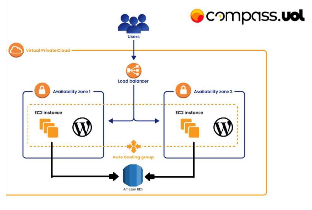
</div>

## Requisitos
Ter uma conta AWS;  
Ambiente Linux acessível para a conexão via ssh (nesse trabalho utilizei o WSL com Ubuntu);

## Check-list de tarefas
- VPC
- Grupo de Segurança
- EFS
- RDS
- EC2 (utilização de Bastion Host)
- Load Balancer

## Etapas
### 1. VPC
* Dentro do site da AWS, siga o caminho: VPC > Suas VPC's > Criar VPC;    
* Selecione VPC e muito mais; 
* Coloque o nome de suas VPC (no exemplo usarei: PROJETO);    
* Por padrão, será criado uma VPC com 4 sub-redes, 2 públicas e 2 privadas;   

<div>
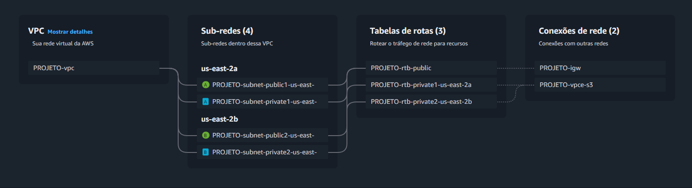
</div>

### 2. Grupo de Segurança
* Aqui iremos criar e configurar 2 grupos de segurança, que serão utilizados durante o projeto;   
* Siga o caminho: EC2 > Grupos de segurança > Criar grupo de segurança;   

#### Grupo de segurança público

<div>
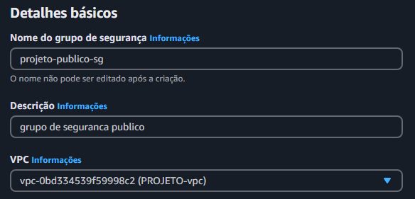
</div>

* Adicione regra de entrada (NFS, TCP, 2049, Qualquer local-IPv4);    
* Adicione regra de entrada (SSG, TCP, 22, Qualquer local-IPv4);  
* Adicione regra de entrada (HTTP, TCP, 80, Qualquer local-IPv4); 
* Adicione regra de entrada (MYSQL/Aurora, TCP, 3306, Qualquer local-IPv4);   

<div>
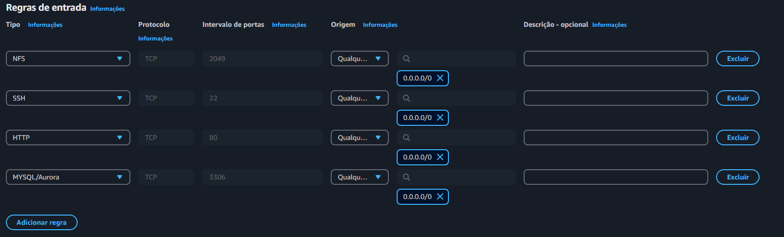
</div>

* Adicione regra de saída (Todo o tráfego, Tudo, Tudo, Qualquer local-IPv4);  

<div>

</div>

#### Grupo de segurança privado

<div>
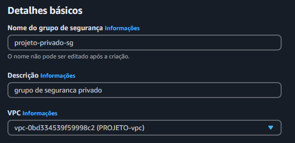
</div>

* Adicione regra de entrada (SSG, TCP, 22, Qualquer local-IPv4);  
* Adicione regra de entrada (HTTP, TCP, 80, Personalizado, projeto-publico-sg);   

<div>
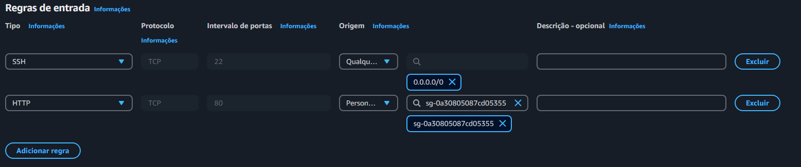
</div>

* Adicione regra de saída (Todo o tráfego, Tudo, Tudo, Qualquer local-IPv4);  

<div>
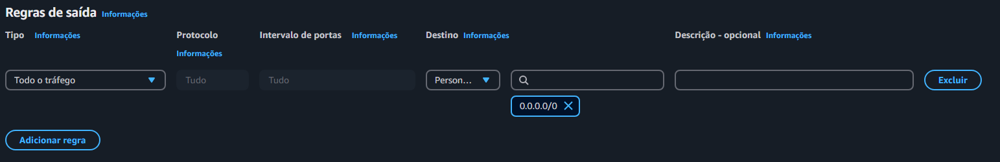
</div>

### 3. EFS  
* Siga o caminho, Amazon EFS > Sistemas de arquivos > Criar sistema de arquivos, Personalizar;    
* Crie um nome;   
* Selecione sua VPC;  
* Em Destinos de montagem, crie dois dentinos, com as duas sub-redes e seus grupos de segurança público;  

<div>
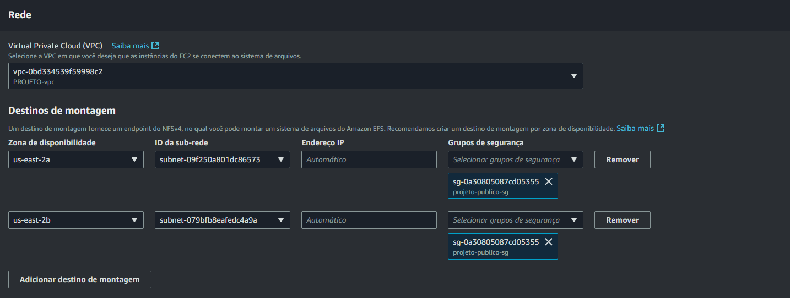
</div>

### 4. RDS  
* Siga o caminho: RDS > Criar bando de dados; 
* Criação Padrão; 
* MySQL;  
* Nível gratuito; 
* Nome: db-projeto;   
* Nome de usuário principal: admin;   
* Crie uma senha; 
* db.t3.micro;    
* Selecione sua VPC;  
* Configuralçao adicional, crie um banco de dados, só colocar o um nome para o banco e deixa o resto padrão;  

<div>
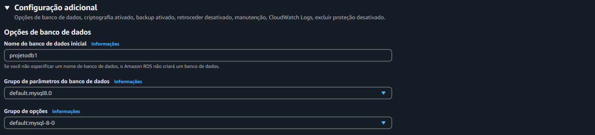
</div>

### 5. Nat Gateway  
* Esse serviço será utilizado para que possa passar internet para a instância privada. Para isso, criaremos um gat em uma sub rede pública e com conexão pública, apóis isso vinculamos com as sub rede's privada utilizando a tabela de rotas;   

<div>

</div>

### 6. EC2

#### Bastion Host   
* Siga o caminho: EC2 > Instâncias > Launch an instance;  
* Adicione uma tag, Chave: Name; Valor: Bastion Host; 
* Em "Tipos de recurso", selecione: Instâncias e Volumes; 

<div>

</div>

* Selecione Ubuntu;   
* Tipos de instância: t2.micro;   
* Selecione criar novo par de chaves (do tipo .pem), adicione um nome e faça o download da chave (será utilizado para acesso ssh.);   
* Em "Configurações de rede": 
    * Selecione sua VPC;  
    * Selecione uma subnet pública;   
    * Habilite um IP público; 
    * Selecione o grupo de segurança público criado anteriomente; 

<div>
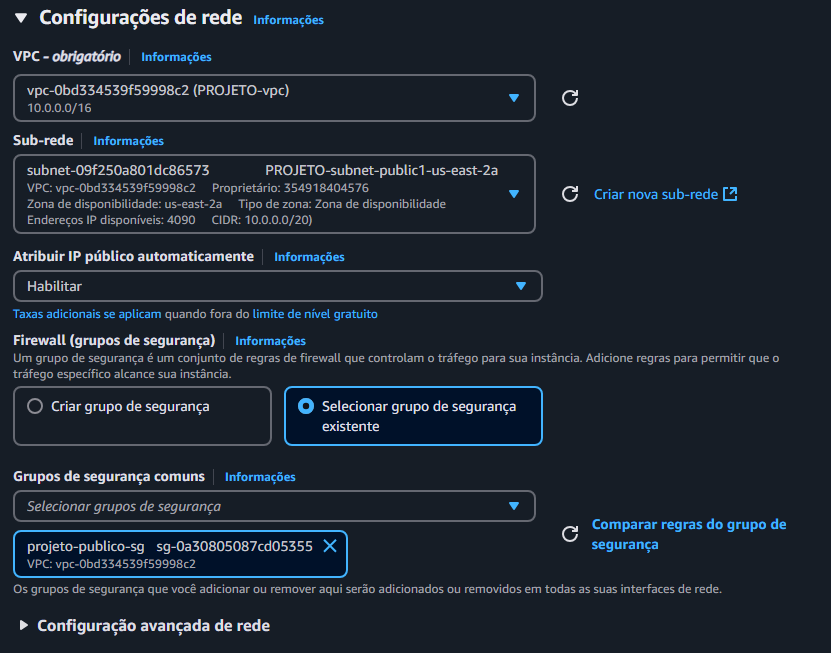
</div>

#### EC2 privada    
* Siga o caminho: EC2 > Instâncias > Launch an instance;  
* Adicione uma tag, Chave: Name; Valor: m-privado;    
* Em "Tipos de recurso" selecione: Instâncias e Volumes;  

<div>
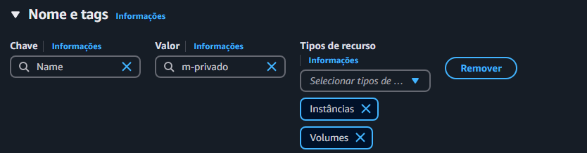
</div>

* Selecione Ubuntu;   
* Tipos de instância: t2.micro;   
* Selecione o par de chaves utilizado no Bastion Host (Também é possível criar uma nova, mas para facilitar, utilizaremos o mesmo);   
* Em "Configurações de rede":     
    * Selecione sua VPC;  
    * Selecione uma subnet privada;   
    * Desabilite o IP público;    
    * Selecione o grupo de segurança privado criado anteriomente; 

<div>
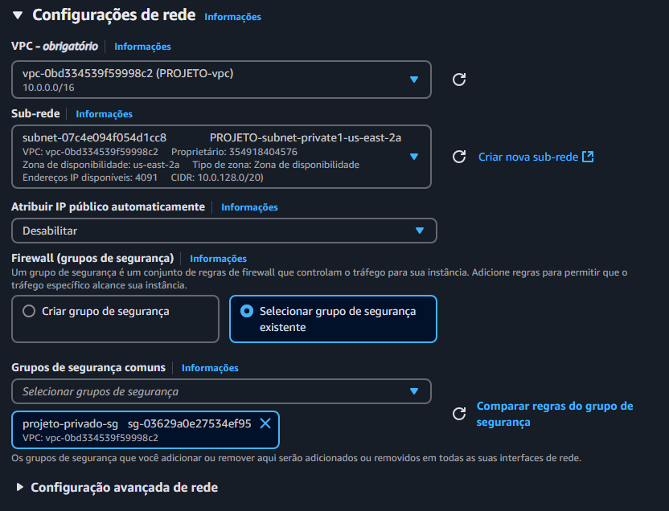
</div>

* Em "Detalhes avançados";    
* Vá até "Dados do usuário" e cole o script abaixo, verifique cada comando, pois precisará preencher informações de RDS e EFS criados anteriormente;  

Para executar o script de configuração do usuário, utilize o script abaixo: 

```bash
#!/bin/bash

# Atualiza pacotes
sudo apt update && sudo apt upgrade -y

# Instala dependências
sudo apt install -y apt-transport-https ca-certificates curl software-properties-common nfs-common

# Configura repositório do Docker
curl -fsSL https://download.docker.com/linux/ubuntu/gpg | sudo apt-key add -
sudo add-apt-repository "deb [arch=amd64] https://download.docker.com/linux/ubuntu $(lsb_release -cs) stable"

# Instala Docker e habilita o serviço
sudo apt update && sudo apt upgrade -y
sudo apt install -y docker-ce containerd.io docker-compose-plugin
sudo systemctl enable docker
sudo systemctl start docker

# Configura grupo Docker
sudo usermod -aG docker ${USER}
newgrp docker

# Instala Docker Compose
sudo curl -L "https://github.com/docker/compose/releases/latest/download/docker-compose-$(uname -s)-$(uname -m)" -o /usr/local/bin/docker-compose
sudo chmod +x /usr/local/bin/docker-compose

# Configura Docker Compose
sudo mkdir -p /app
cat <<EOF > /app/docker-compose.yml
services:
  wordpress:
    image: wordpress:latest
    container_name: wordpress
    ports:
      - "80:80"
    environment:
      WORDPRESS_DB_HOST: <DB_HOST>
      WORDPRESS_DB_USER: <DB_USER>
      WORDPRESS_DB_PASSWORD: <DB_PASSWORD>
      WORDPRESS_DB_NAME: <DB_NAME>
    volumes:
      - /mnt/efs:/var/www/html
volumes:
  wordpress-data:
EOF

# Monta EFS
sudo mkdir -p /mnt/efs
sudo mount -t nfs4 -o nfsvers=4.1,rsize=1048576,wsize=1048576,hard,timeo=600,retrans=2,noresvport <EFS_ENDPOINT>:/ /mnt/efs

# Inicia o container
sudo docker-compose -f /app/docker-compose.yml up -d

```
Ao criar a instância privada, irá aparecer essas opções:    

<div>
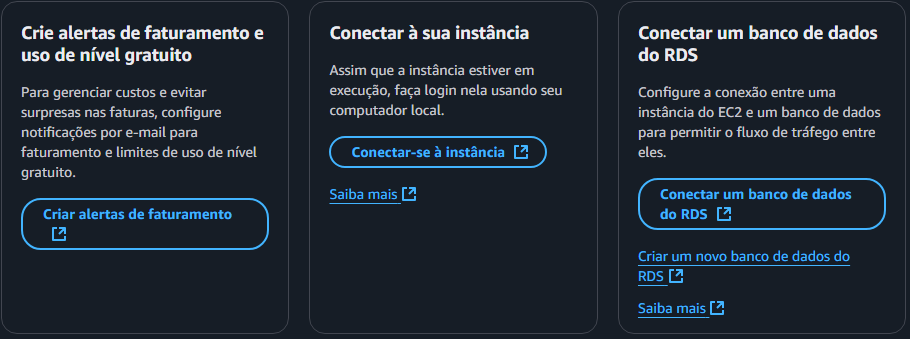
</div>

* Clique em "Conectar um banco de dados do RDS";  
* Selecione "Instância";  
* Selecione a RDS criada anteriormente;   

<div>
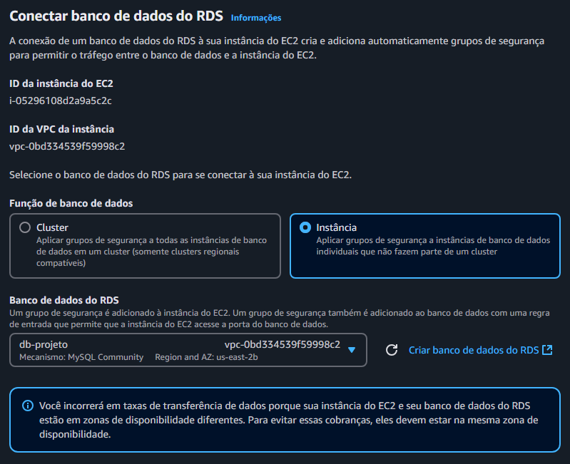
</div>

#### Conexão ssh e comandos 
Nessa parte será utilizado o client WSL com Ubuntu instalado, para utilização do Bastion Host e da EC2 privada via ssh (para isso será necessário o par de chaves criado).  

* Para conectar ao Bastion Host, siga o caminho: EC2 > Instâncias > (Nome da instância) > Conectar;   
* Selecione "Cliente SSH" e copie o código que aparece abaixo de "Exemplo:";  

<div>
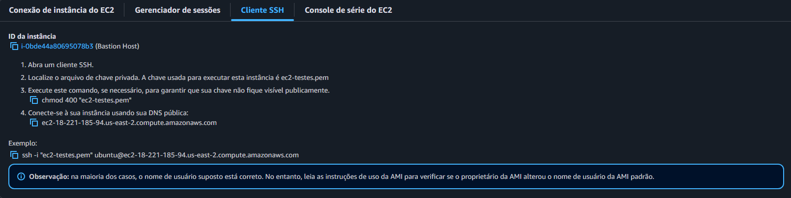
</div>

* Dentro do WSL, vá até ao diretório onde criou sua chave, ou crie caso ainda não tenho criado, depois disso; 
* Dentro da pasta onde o par de chaves está localizado, utilize os comandos:  

```bash
chmod 400 "nome-da-chave.pem"
```

```bash
ssh -i "nome-da-chave.pem" usuario@hostname-ou-ip-publico
```

* Responda "yes" caso necessário; 
* Após conectado ao Bastion Host, vá até ao diretório onde criou sua chave ou crie caso ainda não tenha;  
* Dentro da pasta onde o par de chaves está localizado, utilize os comandos:  

```bash
chmod 400 "nome-da-chave.pem"
```

```bash
ssh -i "nome-da-chave.pem" usuario@endereco-ip-privado
```

* Responda "yes" caso necessário; 
* Agora conectado em sua EC2 privada; 

Permite que o usuário atual execute um comando com privilégios administrativos (root)   
```bash
sudo su
```

Teste se o script funcionou e instalou corretamente. Você pode utlizar comandos como:   

Verifica se o docker está instalado e mostra sua versao 
```bash
sudo docker --version
```

Verifica se o docker-compose está instalado e mostra sua versão 
```bash
docker compose version
```

Verifica todos os containers existentes 
```bash
sudo docker ps -a
```

### 7. Load Balancer    
* Para criar, siga o caminho: EC2 > Load balancers > Comparar e selecionar o tipo de balanceador de cagar;    
* Após isso, clique em "Classic Load Balancer - geração anterior" > Criar;    
* Coloque um nome;    
* Selecione sua VPC;  
* Em "Zonas de disponibilidade", verifique se ambas estão em subnet's públicas;   

<div>
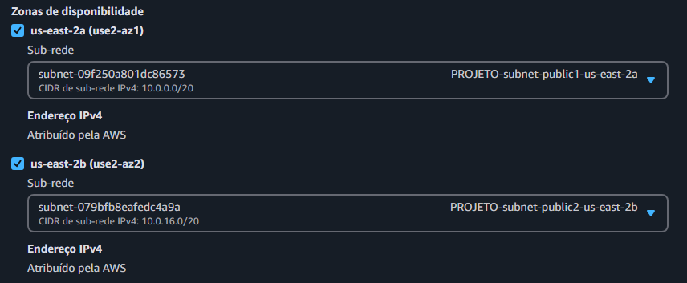
</div>

* Coloque o grupo de segurança público;   

<div>
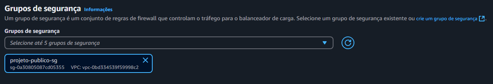
</div>

Em "Verificação de integridade", altere o valor do "Caminho de ping" para:
```cpp
/wp-admin/install.php
```

Após criar o Load balancer, adicione o EC2 privada para que possa ser utilizado o DNS do Load balancer como rota de acesso à aplicação wordpress que está rodando na EC2.
* Siga o caminho: EC2 > Load balancers > Nome-do-lb;
* Clique em "Instâncias de destino" e depois em "Gerenciar instâncias";
* Selecione duas vezes a instância privada (onde está rodando o wordpress);
* Após isso, já é possível abrir o wordpress, utilizando o DNS do Load balancer;

### 8. Auto Scalling    
Crie um grupo de Auto Scalling que utilize o Launch Template, definindo configurações desejadas.

* Associe o Load Balancer ao Auto Scalling group, para que seja possível a distribuição de tráfego para as instâncias EC2;

Ao final, a tela desejada é essa:

<div>
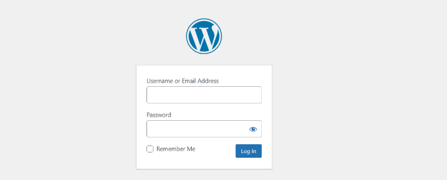
</div>